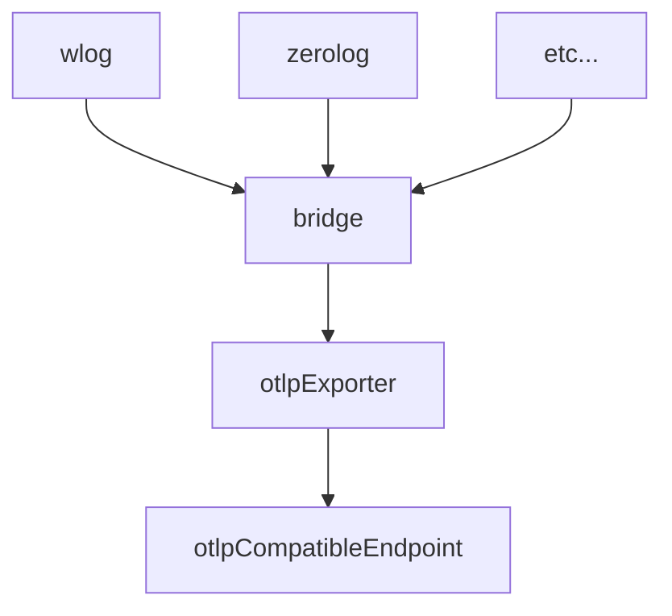

1. Initialize ```logging.LoggerProvider``` as ```logging.New(...)```
2. Initialize your logger (currently supported only ```wlog```, ```zaplog``` and ```zerolog```*limited functionality) with OTLP bridge.
```go
package main

import (
	"context"
	"fmt"
	
	"go.opentelemetry.io/otel/attribute"

	"github.com/webitel/webitel-go-kit/logging"
	"github.com/webitel/webitel-go-kit/logging/wlog"
)

func loggingProvider() error {
	var lo []logging.Option
	lo = append(lo, logging.WithServiceVersion(model.CurrentVersion),
		logging.WithAttributes(attribute.String("service.id", config.NodeName),
			attribute.Int("service.build", model.BuildNumberInt()),
		),
	)

	lp, err := logging.New(context.Background(), model.APP_SERVICE_NAME, opts...)
	if err != nil {
		return fmt.Errorf("unable to initialize logger provider: %v", err)
	}

	logCfg := &wlog.LoggerConfiguration{
		EnableExport: true,
	}

	log := wlog.NewLogger(logCfg)
	wlog.RedirectStdLog(log)
	wlog.InitGlobalLogger(log)

	log.Debug("hello", wlog.String("who", "world"))
	
	return nil
}
```
3. You don't need to refectoring all your logging executions, just simply do ```replace``` in your ```go.mod```.
```go
module main

go 1.22.5

replace github.com/webitel/wlog latest => github.com/webitel/webitel-go-kit/logging/wlog latest
```
4. Don't forget to ```defer logging.LoggerProvider.Shutdown()```